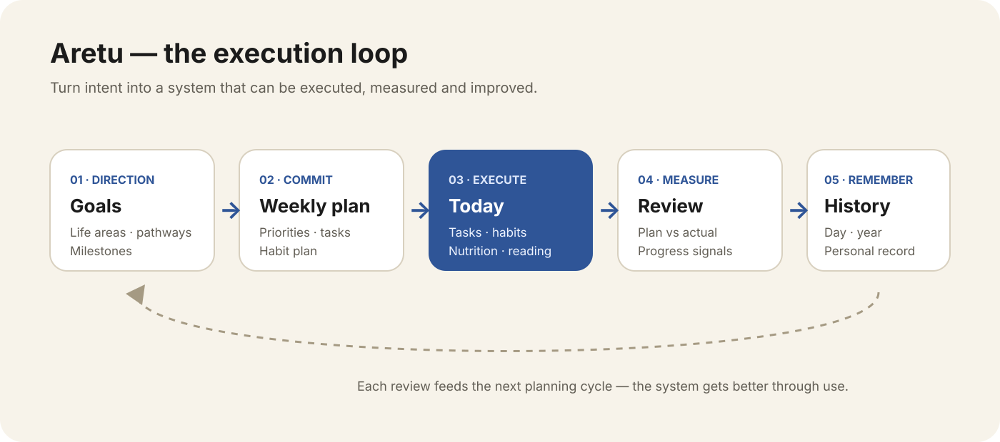
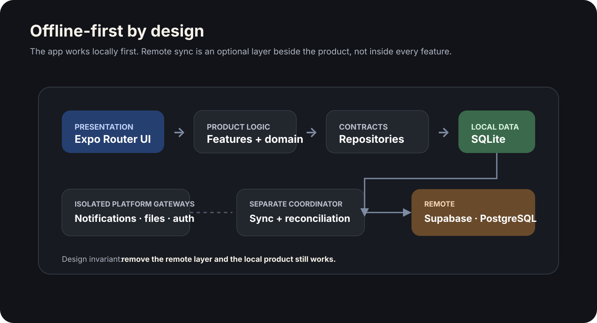

# Aretu — Personal Operating System

> **Role:** Product architecture, system design, implementation and validation  
> **Status:** Release candidate · real-device QA and TestFlight still pending  
> **Source:** Private

Aretu is a mobile-first personal operating system for turning long-term goals into weekly priorities, daily execution and measurable review.

The hard part is not task entry. It is building a system that stays useful offline, preserves a coherent history across devices, and keeps product complexity from leaking into the core domain.

## Product in four screens

**Today** turns the plan into execution. **Planning** limits the week to a small number of priorities. **Goals** connects work to longer-term outcomes. **Progress** turns recorded behavior into feedback for the next cycle.

## At a glance

| | |
|---|---|
| **Core problem** | Turn long-term intent into a repeatable execution loop |
| **Product model** | Goals → weekly planning → daily execution → review → history |
| **Architecture** | Offline-first local SQLite with an isolated sync layer |
| **Reliability focus** | Sync boundaries, identity, bundle checks, multi-layer testing and device QA |
| **Stack** | TypeScript · React Native · Expo · SQLite · Supabase · PostgreSQL |

## What the system does

Aretu connects goal-setting to actual execution. Users can structure goals, plan a week, schedule tasks and habits, execute the day, review plan-versus-actual and preserve the result as a personal history.

The product is bilingual, supports RTL/LTR, includes profile and account flows, and is designed so signed-out or offline usage remains a complete experience rather than a degraded fallback.

## Architecture

The design invariant is simple: **remove the remote sync layer and the local product should still work.**

## Key engineering decisions

### 1. Local-first instead of network-first
Normal reads and writes happen against SQLite. Synchronization is a separate layer, so poor connectivity does not become an application-wide failure mode.

### 2. Keep architecture boundaries executable
Domain logic, repository interfaces, SQLite, remote services, sync and platform-specific integrations are separated deliberately. Architecture tests help prevent those boundaries from eroding as features grow.

### 3. Treat release engineering as product engineering
The verification pipeline extends beyond unit tests: formatting, linting, strict types, domain tests, real SQLite integration tests, PostgreSQL integration tests, platform diagnostics and exported-bundle inspection all exist to catch different classes of failure.

### 4. Use real devices to challenge abstractions
Automated tests cannot see everything. Real iPhone QA exposed layout and interaction defects that the test suite missed; those failures were then turned into regression checks.

## What this project demonstrates

- product thinking translated into system architecture
- offline-first mobile design
- sync and identity boundaries
- database/security discipline
- layered testing and release validation
- willingness to keep a release gate closed until physical QA is complete

## Current status

The codebase is at release-candidate stage. The remaining gate is operational rather than conceptual: consolidated real-device QA, validation against the live backend configuration and the TestFlight/pilot release process.

---

The production source repository remains private. This case study documents the product model, architecture and engineering decisions without publishing source code, credentials or private configuration.
