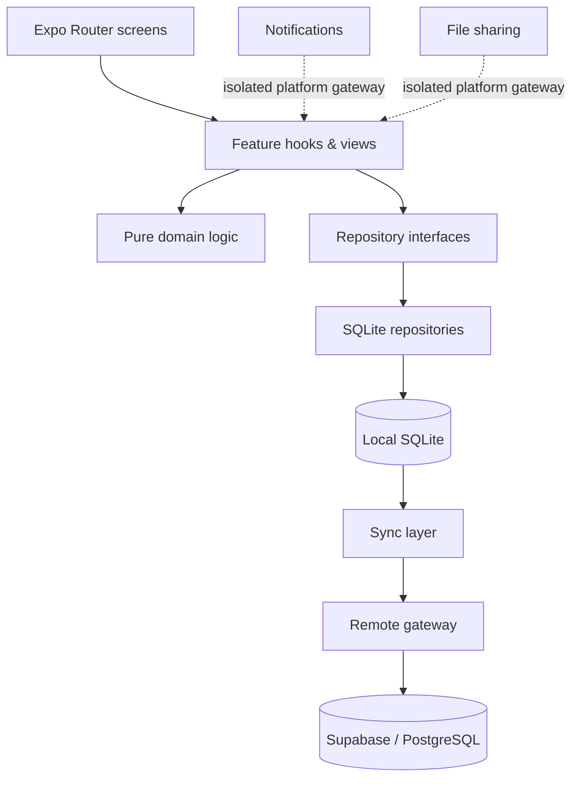

# Aretu — Personal Operating System

> **Role:** Product architecture, system design, implementation and validation  
> **Status:** Release candidate; real-device QA and TestFlight still pending  
> **Source:** Private

Aretu is a mobile-first personal operating system for turning long-term goals into weekly priorities, daily execution and measurable review.

The interesting engineering problem is not another task list. It is building a system that remains useful when the network disappears, preserves a coherent history across devices, and keeps product complexity from leaking into the core domain.

## What I built

- An **offline-first** React Native / Expo application where normal reads and writes happen against local SQLite.
- A separate **sync layer** that can upload and reconcile history through Supabase without becoming a dependency of the local product.
- Goal → pathway → milestone → weekly plan → task/habit execution → review flows.
- Account-scoped profile and language preferences, Google Sign-In support and account deletion infrastructure.
- Hebrew and English support, including RTL/LTR behavior.
- Version-controlled PostgreSQL/Supabase schema with row-level-security checks.
- Automated verification across formatting, linting, types, domain tests, SQLite integration tests and PostgreSQL integration tests.
- Release checks that inspect exported bundles for configuration mistakes and accidental inclusion of sensitive or test-only code.

## Architecture

The core design rule is deliberate: **removing the remote sync layer should still leave a working app**.

## Engineering decisions

### 1. Local-first instead of network-first
A productivity system should not become unavailable because the backend is slow or unreachable. SQLite is the data source used by the application during normal operation; synchronization is a separate concern.

### 2. Boundaries are executable, not aspirational
The codebase separates domain logic, data interfaces, SQLite, remote services, synchronization and platform-specific integrations. Architecture tests enforce key layering rules so boundaries do not silently erode as features are added.

### 3. Release confidence is part of the product
The project treats release engineering as an engineering problem: static checks, multiple test layers, Expo Doctor, database verification and bundle inspection all exist to catch failures that are easy to miss in a happy-path demo.

### 4. Device QA still matters
Automated tests do not replace real hardware. Early iPhone testing found layout and interaction defects that the automated suite could not see; fixes were then backed by regression tests.

## Stack

`TypeScript` · `React Native` · `Expo` · `Expo Router` · `SQLite` · `Supabase` · `PostgreSQL` · `Jest`

## What this project demonstrates

- Product thinking translated into system architecture
- Offline-first application design
- Sync and identity boundaries
- Database and security discipline
- Test strategy beyond unit tests
- Shipping discipline rather than demo-only development

## Current status

The codebase is at release-candidate stage. The remaining gate is intentionally physical and operational: consolidated real-device QA, validation against the live backend configuration and the TestFlight/pilot release process.

---

The production source repository remains private. This case study describes the architecture and engineering decisions without publishing application source code, credentials or private configuration.
