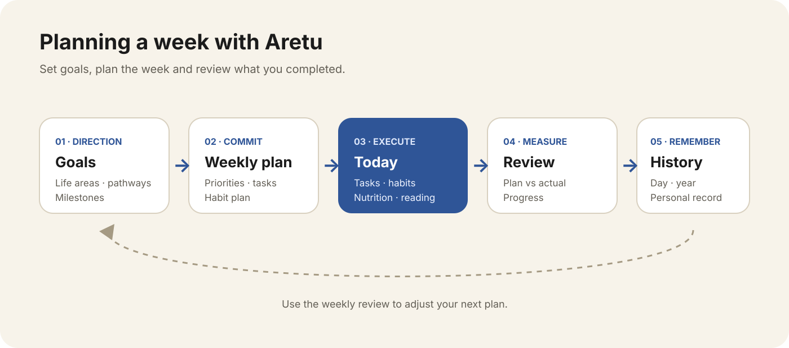
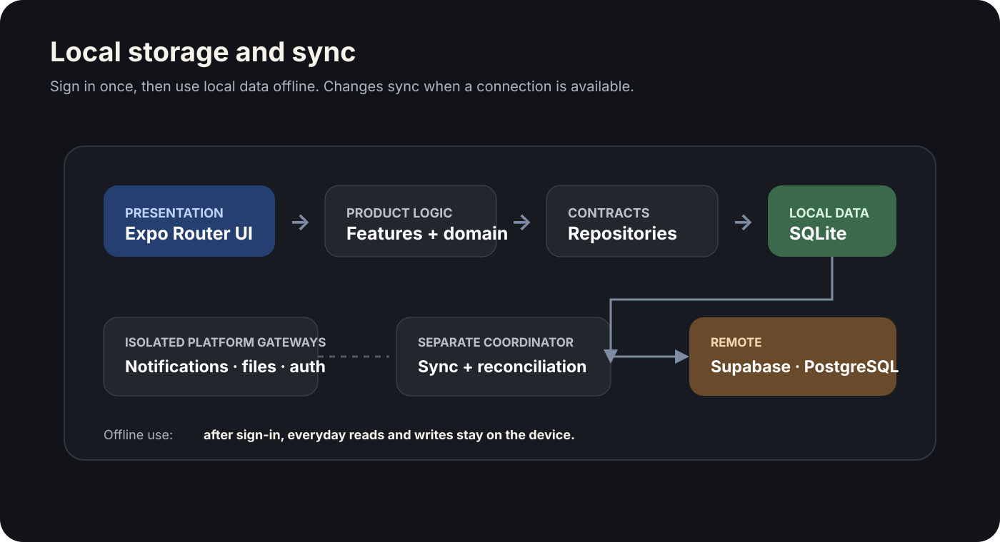

# Aretu

A mobile app for goals, habits, tasks and weekly planning.

**My work:** Product design, architecture, implementation and testing.

[Open web app](https://aretu-dev.vercel.app) · [Back to profile](../README.md)

## Using the app

Aretu connects a long-term goal to the things you plan to do this week. Today shows your tasks and habits; the weekly review compares the plan with what you completed. Previous weeks remain available in your history.

  

The app supports Hebrew and English, including right-to-left layouts. It also includes reminders, books, settings and data export.

## How it works

| Part | Technology |
| --- | --- |
| Mobile app | React Native, Expo and TypeScript |
| Navigation | Expo Router |
| Local storage | SQLite |
| Accounts and sync | Supabase and PostgreSQL |

An account is required. Initial sign-in and some first-time setup need a connection. After a successful sign-in, the app keeps the session on the device and reads and writes everyday data locally, including when launched offline.

Sync runs separately from those local operations. Domain logic, database access and platform services have separate interfaces, with tests that check the import rules.

Account switching needed particular care. Onboarding belongs to each account, and reminders need to stay associated with the right person. If cancelling a notification fails during sign-out, the app records it for another attempt. Notification settings also survive a denied permission request, so the user can enable permission later without rebuilding their reminders.

## Recent work

The September updates covered the sign-in flow, account-specific onboarding, reminder recovery and tighter database permissions. They also added a generated privacy page, account-lifecycle protections and a dedicated message for browsers that block the storage the app needs.

A preliminary iPhone test in Expo Go found layout and interaction issues. Those findings led to fixes and regression tests.

## Testing and release

The merged September entry-flow update recorded these passing results:

| Suite | Tests |
| --- | ---: |
| Unit | 1,760 |
| SQLite integration | 421 |
| PostgreSQL | 292 |

Formatting, linting, type checks, Expo diagnostics, web and iOS exports, and bundle scans also passed for that update.

**v0.10 is still in release preparation.** The full physical-device test pass remains open, along with final OAuth checks, Apple signing and account requirements, signed-build testing and App Store Connect setup. It has not launched on TestFlight or the App Store.

*Updated October 2026. Source code is private.*
