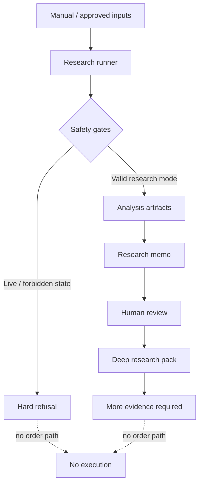

# Atlas — Safety-First Research Agent

> **Role:** System design, guardrails, workflow architecture and implementation  
> **Status:** Research/paper workflow; no live trading or order placement  
> **Source:** Private

Atlas is a local research agent designed around a simple constraint: **automation is only useful if unsafe actions are structurally hard to perform**.

The system explores how an agent can support disciplined equity research while preserving explicit human control, traceability and hard safety boundaries.

## What I built

- A local Python runner for repeatable research workflows.
- Explicit operating-mode configuration with hard refusal paths for live-trading states.
- Structured market snapshots, watchlist scoring and candidate generation from human-provided inputs.
- Research-only trade memo generation with validation requirements for thesis, counter-thesis, invalidation, risk and benchmark comparison.
- Human review states separated from any concept of trade approval.
- Deep-research-pack generation that pushes the workflow toward primary-source evidence before further discussion.
- Append-only operational and decision logs.
- Local scheduling for repeatable research runs.
- Read-only IBKR integration guardrails prepared as configuration and validation logic without enabling live order execution.

## Safety model

There is intentionally **no live-order execution path** in the current system.

## Engineering decisions

### 1. Refuse unsafe states instead of documenting them
A README warning is weak. The runner checks its operating mode and refuses configurations that violate the research-only boundary.

### 2. Separate operational logs from investment decisions
A test run should not look like an investment decision. Atlas keeps technical run logs separate from explicitly committed research-decision records.

### 3. Candidate ≠ recommendation ≠ approval
The workflow uses distinct states for “research deeper,” human review and evidence gathering. This reduces semantic ambiguity in an agentic system.

### 4. Preserve human authority
Generated artifacts can support research, but they do not silently escalate privileges. Human review is explicit and still does not grant trade approval.

## Stack

`Python` · `YAML` · local CLI workflows · structured logs · scheduled execution

## What this project demonstrates

- Safety-first agent design
- Guardrails and failure-mode thinking
- Explicit state machines and permissions
- Auditability and append-only logs
- Human-in-the-loop workflow design
- Resisting the temptation to automate beyond validated boundaries

## Current status

Atlas remains a research/paper system. It does not place live orders, does not contain broker credentials and is not presented as an autonomous trading system.

---

The source repository remains private. This case study intentionally focuses on architecture, safety and workflow design rather than investment strategy or private configuration.
