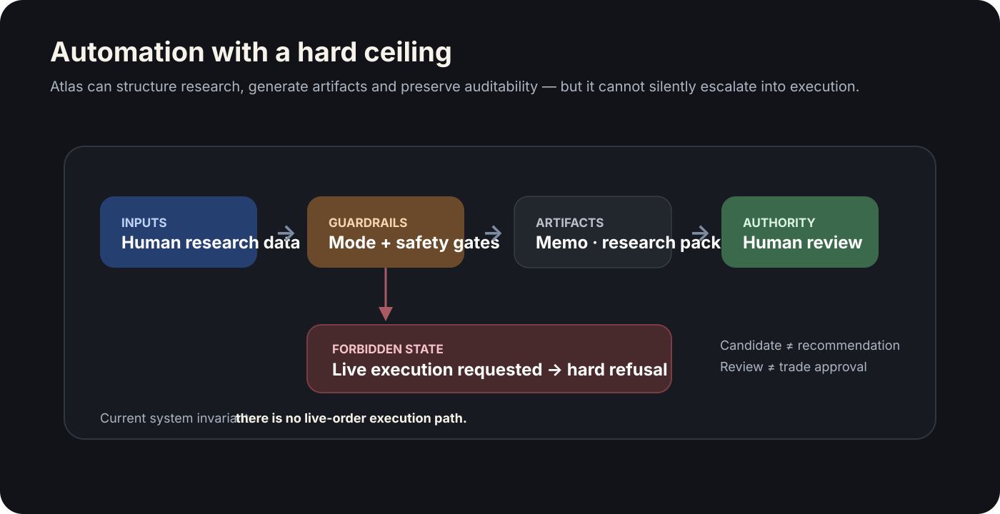
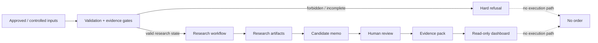

# Atlas — Safety-First Research System

> **Role:** System design, guardrails, workflow architecture and implementation  
> **Status:** Research/paper workflow · CLI + read-only dashboard · no live trading or order placement  
> **Source:** Private

Atlas explores a narrow but important systems problem: **how far should an automated workflow go before human authority must take over?**

It is a research system for disciplined U.S. equity workflows, built around explicit state boundaries, evidence gates, auditability and hard refusal paths instead of vague warnings.

## At a glance

| | |
|---|---|
| **Core problem** | Automate repeatable research without creating an accidental execution path |
| **Key constraint** | Research assistance must never silently become trade authority |
| **Interfaces** | Local CLI + read-only Streamlit dashboard |
| **Architecture** | Python workflow + structured config + evidence gates + append-only artifacts + human review |
| **Safety invariant** | There is no live-order execution path in the current system |
| **Stack** | Python · YAML · Streamlit · scheduled/local workflows · structured logs |

## What the system does

Atlas turns approved or controlled inputs into structured research artifacts: market snapshots, watchlist assessments, candidate research memos, readiness diagnostics, human-review records and deeper evidence packs.

It also includes controlled market-data preparation and diagnostics designed to make missing coverage, provider failures and incomplete evidence visible rather than silently converting them into apparently valid research state.

A read-only Streamlit dashboard exposes the system's research artifacts and readiness state without granting execution authority.

What Atlas **cannot** do is just as important: the current system does not place live orders, does not contain broker credentials and does not treat a generated candidate, reviewed memo or dashboard state as trade approval.

## Safety model

## Key engineering decisions

### 1. Refuse unsafe states in code
A warning in documentation is not a control. Atlas validates its operating mode and evidence state and rejects configurations that violate the research-only boundary.

### 2. Make states semantically explicit
**Candidate**, **memo**, **evidence readiness**, **human review** and **execution authority** are different concepts. The system keeps them separate so progress through research cannot silently acquire more privilege.

### 3. Treat incomplete data as a state, not an inconvenience
Controlled ingestion and provider diagnostics expose gaps and parsing failures explicitly. The system prefers an honest blocked state over a complete-looking artifact built on incomplete evidence.

### 4. Preserve auditability
Operational runs and investment-research decisions are recorded separately. This prevents test runs and automation noise from masquerading as investment decisions.

### 5. Keep privilege escalation impossible by default
Future read-only brokerage integration must prove its own boundary. Execution privileges remain outside the current architecture rather than being disabled behind a configuration flag.

## Engineering signal

The repository includes a broad automated test suite around safety, activation criteria, evidence maturity, artifact isolation, research-agent flows and synchronization behavior. It also includes a deployable read-only Streamlit dashboard shell.

The main remaining engineering debt is structural: several Python and dashboard modules have grown too large. The next step is decomposition and a unified Python quality gate — not more product scope.

## Why this project matters

The interesting part of Atlas is not the financial domain. It is the design pattern:

- automation with a hard capability ceiling
- explicit human authority
- refusal as a first-class system behavior
- controlled data ingestion and evidence readiness
- append-only state and traceability
- safety boundaries that survive future feature growth

Those patterns transfer directly to higher-stakes agentic systems in operations, infrastructure and physical technology.

## Current status

Atlas remains intentionally constrained to research/paper workflows. The next valuable work is architectural cleanup: split oversized modules, standardize packaging/lint/type/test tooling and keep generated runtime artifacts out of the code surface.

---

The source repository remains private. This public case study focuses on system design and guardrails rather than investment strategy, credentials or private configuration.
