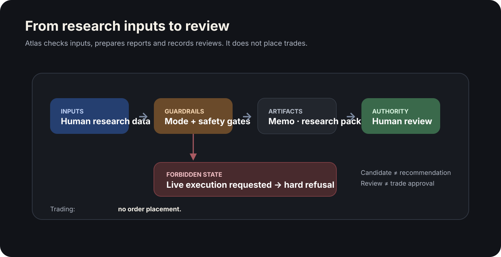

# Atlas

A Python research tool for U.S. stocks, with a command-line workflow and a read-only Streamlit dashboard.

**My work:** System design, research workflow, safety checks and implementation.

[Back to profile](../README.md)

## What it does

Atlas takes market snapshots, watchlists and research inputs and produces reports, candidate memos and supporting evidence for review. The dashboard shows those outputs alongside data gaps and workflow status.

The current system is limited to research and paper workflows. It does not place orders or connect to a live trading account.

Python · YAML · Streamlit

## Handling data and review

Missing prices, incomplete coverage and parsing errors are reported explicitly. Data preparation and import have separate checks, so a failed provider request doesn't quietly become a valid input.

Research candidates, completed memos and human review are separate states. A memo needs sections such as the counter-thesis, invalidation conditions and risk. Recording a review doesn't authorize a trade.

Operational logs are kept separate from research decisions. That makes it easier to tell a scheduled or test run from an analysis someone deliberately saved.

## Implementation

The command-line runner handles research generation, input validation and diagnostics. Reports, memos, evidence packs and review records are stored as files and append-only logs. The Streamlit dashboard reads those records.

Configuration checks reject unsupported operating modes. There is no order-placement code path to enable through a setting. Any future brokerage integration would need a separate implementation and review.

Automated tests cover safety checks, required evidence, separation of generated outputs, research workflows and synchronization. A Render deployment configuration is included for the dashboard; this page does not link to a running public demo.

## What needs work

Several Python modules and dashboard files have grown too large. The next step is to split them into smaller modules, standardize the linting, type-checking and test commands, and keep generated runtime files out of the source tree.

*Updated October 2026. Source code is private.*
