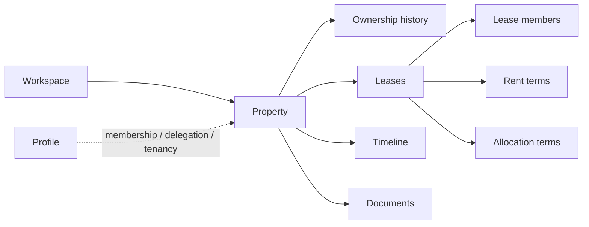

# HomeRun V2 — Property Lifecycle System

> **Role:** Product architecture, domain modeling and implementation  
> **Status:** Active development · identity/access, property lifecycle and leases/tenants implemented  
> **Source:** Private

HomeRun V2 is a property lifecycle management platform for residential rental properties — a system of record for the life of a property from acquisition to sale.

The hard part is not CRUD. It is preserving **historical truth** across years while different people gain and lose different kinds of access.

A property can change owners without changing managers. A tenant can leave without erasing the lease they were part of. Rent can change without rewriting what was true last month. A former tenant, current tenant, co-owner and delegated manager can all need different views of the same asset.

## At a glance

| | |
|---|---|
| **Frontend** | React · TypeScript · Vite |
| **Backend** | Supabase Auth · PostgreSQL · RLS |
| **Architecture** | Domain-owned features + provider boundary |
| **Security model** | Capabilities derived from relationships |
| **Historical model** | Effective-dated records + append/supersede semantics |
| **Implemented domains** | Identity/access · property lifecycle · leases/tenants |
| **Next major phase** | Financial core |

## Product model



The core principle is simple:

**economic ownership, operational access and tenancy are different relationships.**

They should not be collapsed into one global `user.role`.

## What is implemented

### Identity and access

- Supabase Auth profile foundation
- workspaces and membership administration
- role-to-capability model
- invitations and revocation flows
- property-specific access grants
- effective-access reporting
- audit records for sensitive operations
- adversarial allow/deny RLS tests

### Property lifecycle

- properties and acquisition records
- person and legal-entity owner holders
- effective-dated ownership history
- ownership-change and sale operations
- portfolio and Property Passport surfaces
- timeline events and audit records emitted with domain operations
- authorization anchors for future document storage

### Leases and tenants

- leases, lease members and tenant invitations
- effective-dated rent terms
- effective-dated allocation terms
- guarantees
- activation, renewal, ending and cancellation
- tenant replacement and participation history
- current and past tenancy read models
- occupancy derived from active leases
- tenant access that expires when participation ends

## Engineering decisions

### 1. History is a first-class product requirement

A property exists for years. Important facts are closed, superseded or appended rather than silently overwritten. The system should be able to answer **what was true on a specific date?**

### 2. Capabilities come from relationships

Access is derived from workspace membership, property delegation and tenancy. This supports the real-world case where one person can be an owner in one place and a tenant somewhere else.

### 3. High-value operations are atomic

Property creation, ownership change, sale and other domain operations are implemented as database-side transactions where the state change, timeline event and required audit record succeed or fail together.

### 4. RLS is treated as a testable security boundary

The repository does not stop at writing policies. Sensitive access rules ship with explicit **allow and deny** tests designed to prove that one user cannot cross another user's boundary.

### 5. Financial automation waits for temporal correctness

The lease model settles rent and allocation history before the financial engine generates charges. Automating money on top of ambiguous historical data would be faster initially and much more expensive later.

## Architecture

```text
src/
  features/
    identity/
    accounts/
    properties/
    leases/
    finance/
    maintenance/
    documents/
    inspections/
    action-center/
  infrastructure/       Provider-specific boundary
  shared/               Shared UI and cross-cutting primitives

supabase/
  migrations/           Schema, RLS, predicates and atomic operations
  tests/                Security / migration verification

docs/                   Product and engineering contracts
```

The import boundary is enforced rather than merely documented: provider-specific infrastructure stays isolated from feature-owned domain code.

## What this project demonstrates

- Complex domain modeling before premature feature expansion
- Temporal / effective-dated data design
- Capability-based authorization
- PostgreSQL and RLS security discipline
- Atomic lifecycle operations and auditability
- Product scope discipline in a financially sensitive domain

## Current status

HomeRun V2 is in active development. Identity/access, property lifecycle and leases/tenants have real schema, operations and application surfaces. The next major dependency is the financial core; later phases add maintenance, the full document platform and beta hardening.

This is deliberately presented as an **in-progress system**, not a finished property-management product.

---

The production repository remains private. The public case study focuses on the domain model and engineering decisions without exposing private configuration or data.
