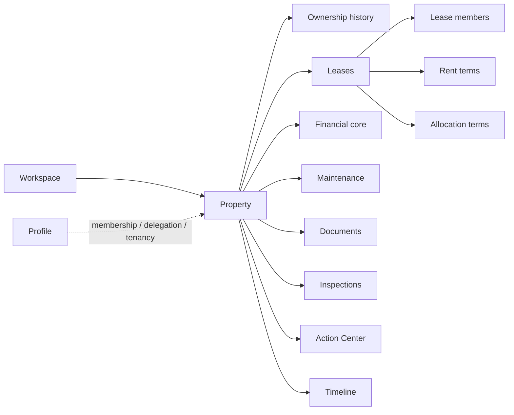

# HomeRun V2 — Property Lifecycle System

> **Role:** Product architecture, domain modeling and implementation  
> **Status:** Active development · functional V1 scope through finance, maintenance, documents, inspections and Action Center implemented · beta hardening next  
> **Source:** Private

HomeRun V2 is a property lifecycle management platform for residential rental properties — a system of record for the life of a property from acquisition to sale.

The hard part is not CRUD. It is preserving **historical truth** across years while different people gain and lose different kinds of access, money changes hands, maintenance work becomes financial history and documents remain visible only to the right people.

A property can change owners without changing managers. A tenant can leave without erasing the lease they were part of. Rent can change without rewriting what was true last month. A maintenance ticket can become an expense without double-counting. A former tenant, current tenant, co-owner and delegated manager can all need different views of the same asset.

## At a glance

| | |
|---|---|
| **Frontend** | React · TypeScript · Vite · TanStack Query |
| **Backend** | Supabase Auth · PostgreSQL · Row Level Security |
| **Architecture** | Domain-owned features + isolated provider boundary |
| **Security model** | Capabilities derived from relationships |
| **Historical model** | Effective-dated records + append/supersede semantics |
| **Implemented domains** | Identity/access · property lifecycle · leases/tenants · finance · maintenance · documents · inspections · Action Center |
| **Reliability focus** | Atomic operations · adversarial allow/deny tests · schema reproducibility · storage boundary checks |
| **Next phase** | Beta hardening with real users and real data |

## Product model



The core principle is simple:

**economic ownership, operational access and tenancy are different relationships.**

They should not be collapsed into one global `user.role`.

## What is implemented

### Identity and access

- Supabase Auth profile foundation and Google OAuth
- workspaces and membership administration
- role-to-capability model
- invitations and revocation flows
- property-specific access grants
- effective-access reporting
- audit records for sensitive operations
- adversarial allow/deny RLS tests

### Property lifecycle

- properties and acquisition records
- person and legal-entity owner holders
- effective-dated ownership history
- ownership-change and sale operations
- portfolio and Property Passport surfaces
- timeline events and audit records emitted with domain operations

### Leases and tenants

- leases, lease members and tenant invitations
- effective-dated rent and allocation terms
- guarantees
- activation, renewal, ending and cancellation
- tenant replacement and participation history
- current and past tenancy read models
- occupancy derived from active leases
- tenant access that expires when participation ends

### Financial core

- rent-charge generation on settled temporal facts
- append-only financial corrections instead of destructive edits
- owner-side expense recording and lifecycle integration
- maintenance closure that creates exactly one linked expense
- database-side idempotency and auditability around financially meaningful operations

### Maintenance

- service tickets and explicit lifecycle transitions
- tenant-safe read surfaces that do not expose quotes or owner costs
- professional contacts and manual quote workflow
- follow-up behavior that preserves closed-ticket financial history

### Documents, inspections and Action Center

- private document storage behind a trusted server boundary
- explicit document visibility and recipients rather than a general-purpose ACL engine
- move-in / move-out inspection capture and tenant acknowledgement
- property timeline with reader-specific payload filtering
- derived Action Center items for expiring guarantees, overdue rent, maintenance approvals and document attention
- dismiss/snooze state keyed to the underlying domain state so stale alerts naturally return when facts change

## Engineering decisions

### 1. History is a first-class product requirement

A property exists for years. Important facts are closed, superseded or appended rather than silently overwritten. The system should be able to answer **what was true on a specific date?**

### 2. Capabilities come from relationships

Access is derived from workspace membership, property delegation and tenancy. This supports the real-world case where one person can be an owner in one place and a tenant somewhere else.

### 3. High-value operations are atomic

Property creation, ownership changes, sale, financial corrections and maintenance closure are database-side operations where required state, timeline and audit records succeed or fail together.

### 4. RLS is treated as a testable security boundary

Sensitive access rules ship with explicit **allow and deny** tests. CI rebuilds the database from committed migrations and fails if generated application types drift from the schema.

### 5. Files are authorized by records, not paths

The browser does not get general Storage authority. Document access is decided from the database record and a trusted boundary issues the short-lived file access required for that one authorized object.

### 6. Derived state stays derived

Occupancy, overdue state and Action Center items are computed from domain truth instead of duplicated into writable status fields that can silently become stale.

## Architecture

```text
src/
  features/
    identity/
    accounts/
    properties/
    leases/
    finance/
    maintenance/
    documents/
    inspections/
    action-center/
  infrastructure/       Provider-specific boundary
  shared/               Shared UI and cross-cutting primitives

supabase/
  migrations/           Schema, RLS, predicates and atomic operations
  functions/            Trusted document-storage boundary
  tests/                Security / migration verification

docs/                   Product and engineering contracts
```

The import boundary is enforced rather than merely documented: provider-specific infrastructure stays isolated from feature-owned domain code.

## What this project demonstrates

- complex domain modeling before premature feature expansion
- temporal / effective-dated data design
- capability-based authorization
- PostgreSQL and RLS security discipline
- financially meaningful atomic operations and idempotency
- private-file authorization design
- derived workflows that avoid stale duplicated state
- product scope discipline across a long-lived system of record

## Current status

The functional V1 scope now covers the property lifecycle through finance, maintenance, private documents, inspections and the Action Center. The next step is **Beta Hardening**: full security/accessibility review, responsive and RTL QA, end-to-end core journeys, observability, backup/restore validation and closed-beta use with real landlords.

This is deliberately presented as an **in-progress system**, not a finished production property-management product.

---

The production repository remains private. The public case study focuses on the domain model and engineering decisions without exposing private configuration or data.
