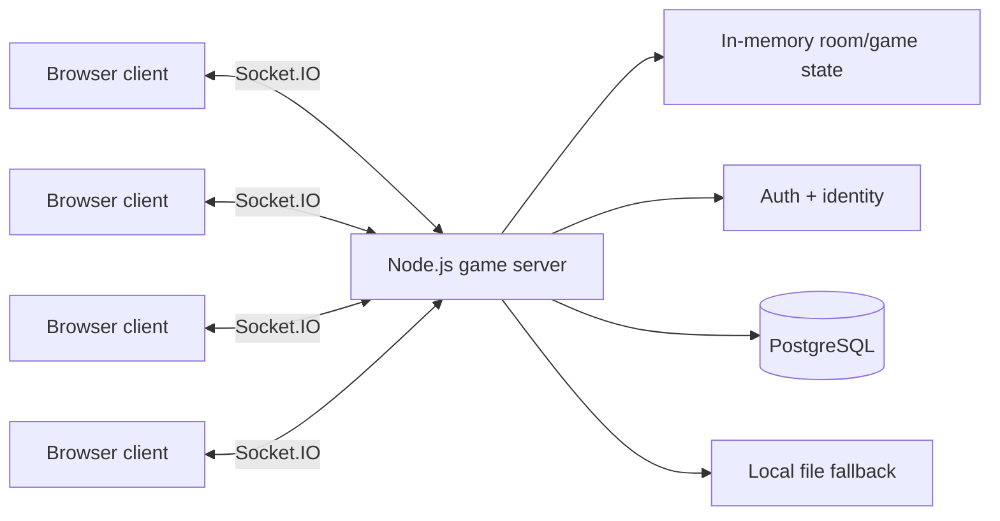

# Sugar Game — Real-Time Multiplayer System

> **Role:** Product design and full-stack implementation  
> **Status:** Working multiplayer application  
> **Source:** Private

Sugar Game is a 4-player multiplayer Israeli Whist game built around real-time rooms, persistent identity and live game state.

The project started as a game, but the engineering problem is broader: coordinate multiple clients, preserve identity through reconnects, keep room state coherent, and persist user/social data without making the live game loop brittle.

## What I built

- Real-time multiplayer rooms using Socket.IO.
- Express-based HTTP server with browser client delivery.
- User registration and login with hashed passwords and signed stateless auth tokens.
- PostgreSQL-backed persistent users, points, friendships and leaderboard data, with local-file fallback for development.
- Multi-room game state and reconnect-aware identity handling.
- Daily / weekly / all-time leaderboard flows and leaderboard trend snapshots.
- Friend-request and social graph functionality.
- QR-based join flow for fast second-device entry.
- Cloud-host-aware URL handling and health diagnostics.

## Architecture

## Engineering decisions

### 1. Separate live state from persistent identity
Game rounds need fast in-memory coordination; accounts, points and social state need persistence. Treating those as different problems keeps the live loop simpler.

### 2. Reconnects are a first-class multiplayer problem
A multiplayer game is not reliable if a refresh or network interruption destroys player identity. The system treats identity and room reclaim as part of the product, not as edge-case polish.

### 3. Build for local and hosted environments
The server can run on a local network or behind a cloud proxy, and derives the public join URL from the active request instead of hardcoding deployment-specific addresses.

### 4. Persistence has an explicit fallback
When PostgreSQL is available it is used for permanent state. Development can still run against a local file store, while health information makes degraded persistence visible.

## Stack

`Node.js` · `Express` · `Socket.IO` · `PostgreSQL` · browser JavaScript · HTML/CSS

## What this project demonstrates

- Real-time state coordination
- Multiplayer session design
- Authentication and identity
- PostgreSQL persistence
- Reconnect and failure-mode handling
- Moving a prototype toward a deployable multi-user product

## Engineering debt

The current implementation proved the system end-to-end, but the server and browser client grew too large and monolithic. The next engineering step is decomposition into smaller game-engine, transport, persistence and UI modules with automated tests around the state machine.

That debt is included here intentionally: shipping a working system matters, but so does recognizing when the architecture needs to be simplified before the next scale step.

---

The production source repository remains private. This case study describes the system without publishing user data, secrets or private deployment configuration.
