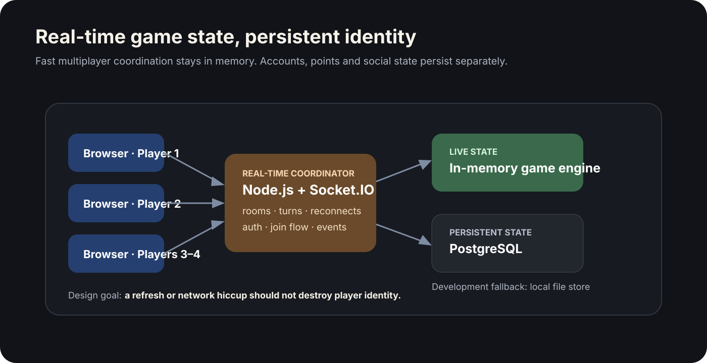

# Sugar Game — Real-Time Multiplayer System

> **Role:** Product design and full-stack implementation  
> **Status:** Working multiplayer application  
> **Source:** Private

Sugar Game is a four-player multiplayer card game built around a more general engineering problem: **keeping several clients, identities and persistent user states coherent while the live game keeps moving.**

The product started as a game, but the useful portfolio signal is broader — real-time coordination, reconnect handling, authentication, persistence and operating across both local-network and hosted environments.

## At a glance

| | |
|---|---|
| **Core problem** | Coordinate live multiplayer state without losing identity or persistence |
| **Real-time layer** | Node.js + Socket.IO + in-memory room/game state |
| **Persistent layer** | PostgreSQL users, points, friendships and leaderboard data |
| **Reliability concern** | Reconnects, refreshes and degraded persistence must be visible and recoverable |
| **Stack** | Node.js · Express · Socket.IO · PostgreSQL · browser JavaScript |

## What the system does

Players can create or join rooms, authenticate, play live rounds, reconnect to active sessions and keep persistent account/social state across games.

The same server supports local-network play and cloud deployment. QR-based joining reduces friction for second-device entry, while health diagnostics make backend degradation visible instead of silently failing.

## Key engineering decisions

### 1. Separate live state from persistent state
Fast turn-by-turn coordination belongs in memory. User identity, social relationships, cumulative points and leaderboard history belong in persistent storage. Treating them as separate problems keeps the game loop simpler.

### 2. Treat reconnects as product behavior
A multiplayer experience is not reliable if a refresh destroys the player. Identity reclaim and room recovery are part of the core session model, not optional polish.

### 3. Avoid deployment-specific assumptions
The server derives its public join URL from the active request, so the same code can run locally or behind a hosted reverse proxy without hardcoded environment URLs.

### 4. Degrade explicitly
PostgreSQL is the permanent store when available. A local-file fallback keeps development usable, while diagnostics expose when the system has dropped into a degraded persistence mode.

## What this project demonstrates

- real-time event coordination
- multiplayer session and room design
- authentication and persistent identity
- PostgreSQL-backed social/product state
- reconnect and failure-mode handling
- moving a prototype into a deployable multi-user system

## Engineering debt

The system works end to end, but the server and browser client became too monolithic as features accumulated. The next engineering step is not “add more features”; it is to split the game engine, transport, persistence and UI boundaries and add automated state-machine tests.

That trade-off is worth showing. Shipping proves the product loop. Recognizing when the structure needs decomposition proves engineering judgment.

---

The production source remains private. This case study describes the architecture and trade-offs without exposing user data, secrets or deployment configuration.
