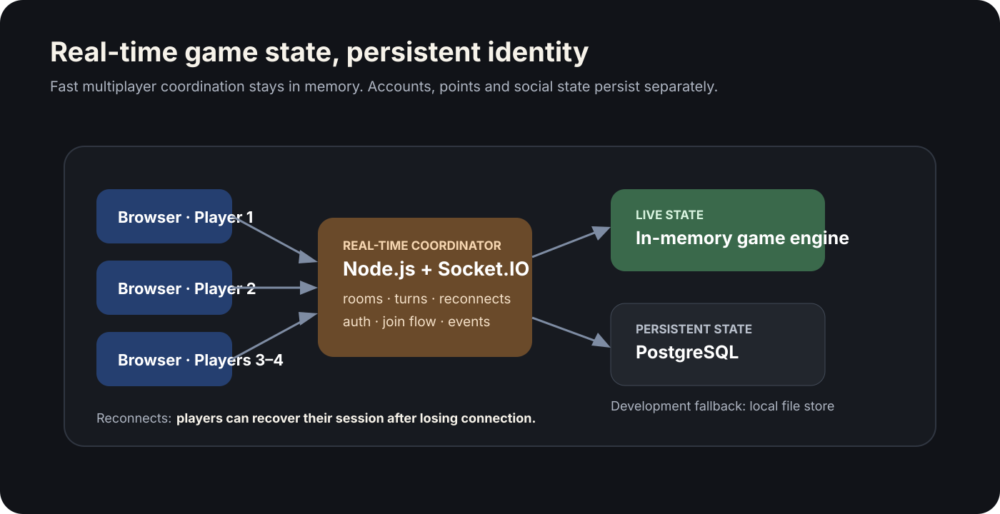

# Sugar Game

An online, four-player Israeli Whist game with rooms, accounts, friends and leaderboards.

**My work:** Product design and full-stack implementation.

[Back to profile](../README.md)

## Playing

Players can create or join a room, play live rounds and recover their session after a refresh or dropped connection. Accounts keep points, friends and leaderboard history across games. QR codes make it easier to join from another device.

The app supports local-network play and hosted deployment.

## How it works

| Part | Technology |
| --- | --- |
| Server | Node.js and Express |
| Real-time events | Socket.IO |
| Accounts and social data | PostgreSQL |
| Client | Browser JavaScript, HTML and CSS |

Rooms, turns and the current game are held in memory. Accounts, points, friendships and leaderboard records are stored separately in PostgreSQL.

Reconnect handling links a returning connection to the player's existing identity and room. The server also builds join URLs from the incoming request, so they work on a local network or behind a hosted proxy.

A local-file store is available for development. Health diagnostics report when the expected database storage is unavailable.

## What needs work

The multiplayer app works end to end, but the server and browser client have become large files with too many responsibilities.

The next step is to separate game rules, rooms and socket events, authentication, storage and the UI. Automated tests for the game state transitions and multi-client sessions need to grow alongside that refactor.

*Updated October 2026. Source code is private.*
